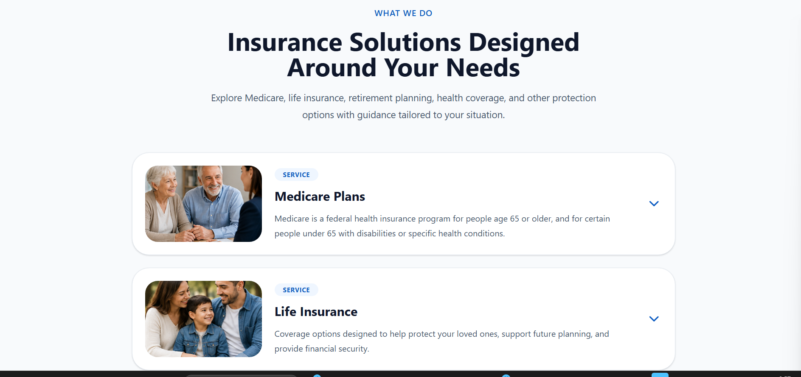
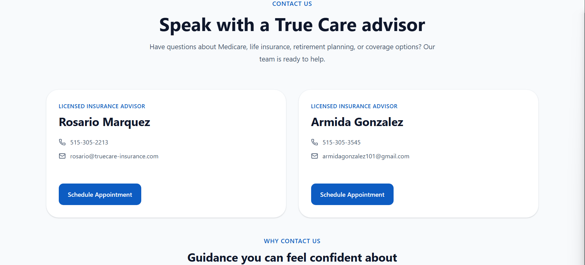

# 🛡️ True Care Insurance

A modern bilingual insurance agency website built with React and Vite.

## 🌐 Live Demo

https://true-care-insurance.vercel.app

---

## 📖 Overview

True Care Insurance is a responsive, SEO-optimized website developed for an insurance agency that specializes in:

* Medicare Plans
* Health Insurance
* Life Insurance
* Retirement Planning
* Group Insurance

The website provides bilingual support (English & Spanish), appointment scheduling, contact information, and educational content while maintaining a professional and accessible user experience.

---

## ✨ Features

* Responsive Design
* English / Spanish Language Toggle
* SEO Optimized
* Open Graph Metadata
* Schema.org Structured Data
* Canonical URLs
* robots.txt
* Appointment Scheduling (Calendly)
* Mobile Navigation
* Optimized Images
* Modern UI using Tailwind CSS

---

## 🛠️ Technologies

* React
* Vite
* React Router
* Context API
* Tailwind CSS
* React Helmet Async
* Lucide React
* Vercel

---

## 📌 Project Highlights

- Developed for a real insurance agency client.
- Implemented bilingual support using React Context API.
- Designed with a mobile-first responsive approach.
- Integrated Calendly for online appointment scheduling.
- Applied SEO best practices including Open Graph, Schema.org, Canonical URLs and robots.txt.
- Optimized for production deployment with Vercel.

---

## 📸 Screenshots

### Home


### Services



### About


### Contact



### Schedule


---

## 🚀 Installation

```bash
git clone https://github.com/JUJOSANE/trueCare-Seguro.git

cd trueCare-Seguro

npm install

npm run dev
```

---

## 📦 Production Build

```bash
npm run build
```

---

## 🌍 Deployment

The application is deployed using **Vercel**.

---

## 📈 SEO Features

* Meta Tags
* Open Graph
* Twitter Cards
* Canonical URLs
* robots.txt
* Schema.org (InsuranceAgency)

---

## 👨‍💻 Developer

Juan José Sánchez

Software Developer

Colombia


<!-- # React + Vite

This template provides a minimal setup to get React working in Vite with HMR and some ESLint rules.

Currently, two official plugins are available:

- [@vitejs/plugin-react](https://github.com/vitejs/vite-plugin-react/blob/main/packages/plugin-react) uses [Oxc](https://oxc.rs)
- [@vitejs/plugin-react-swc](https://github.com/vitejs/vite-plugin-react/blob/main/packages/plugin-react-swc) uses [SWC](https://swc.rs/)

## React Compiler

The React Compiler is enabled on this template. See [this documentation](https://react.dev/learn/react-compiler) for more information.

Note: This will impact Vite dev & build performances.

## Expanding the ESLint configuration

If you are developing a production application, we recommend using TypeScript with type-aware lint rules enabled. Check out the [TS template](https://github.com/vitejs/vite/tree/main/packages/create-vite/template-react-ts) for information on how to integrate TypeScript and [`typescript-eslint`](https://typescript-eslint.io) in your project.
 -->
